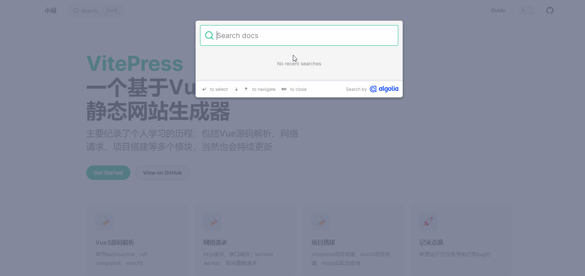
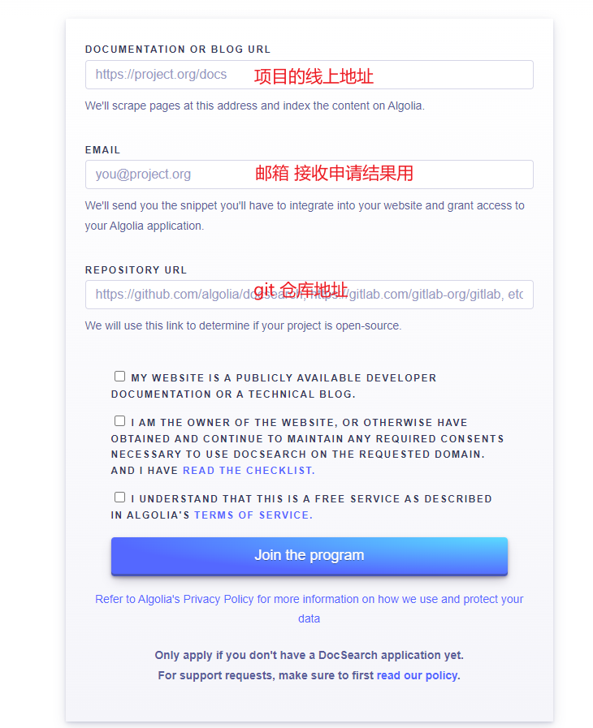
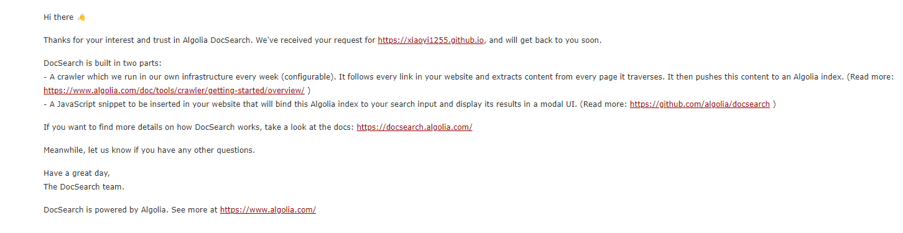
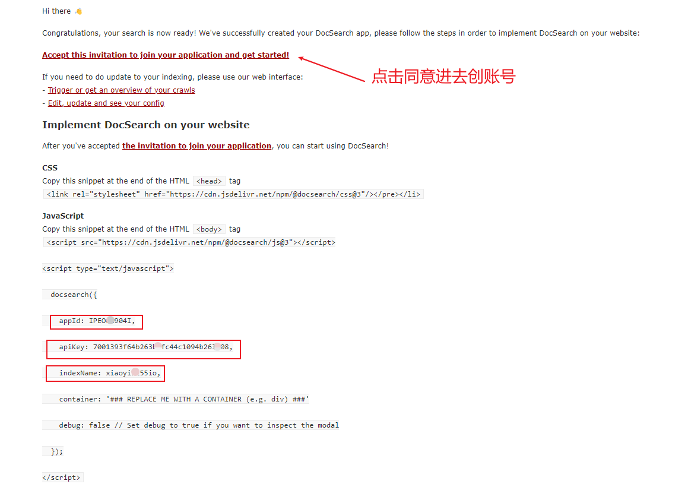

## 效果图 {#效果图}


## Algolia {#Algolia}
Algolia是一家提供搜索和实时数据索引服务的平台，它主要提供了网站内：
* 搜索功能
* 排序和过滤
* 拼写纠正
* 模糊匹配

## Algolia接入 {#Algolia接入}
## 申请 {#申请}
#### 1.填写申请
[申请地址](https://docsearch.algolia.com/apply) 填好申请表，那三个选项都需要勾选一下

#### 2.会收到一条邮件

#### 3.静候1-3天会收到申请结果邮件

#### 4.点击同意后填写账号密码什么的
进去之后还会有一个accept同意的按钮是接受application的，点accept就行了，这里忘记截图了。
#### 5.项目开启全局搜索
这里因为VitePress原先就支持algolia所以直接配置就可以使用了
```json
algolia: {
    appId: 'xxx',
    apiKey: 'xxxx',
    indexName: 'xxxx'
}
````

接下来就开启全局搜索之路了，赶紧试试去吧！

